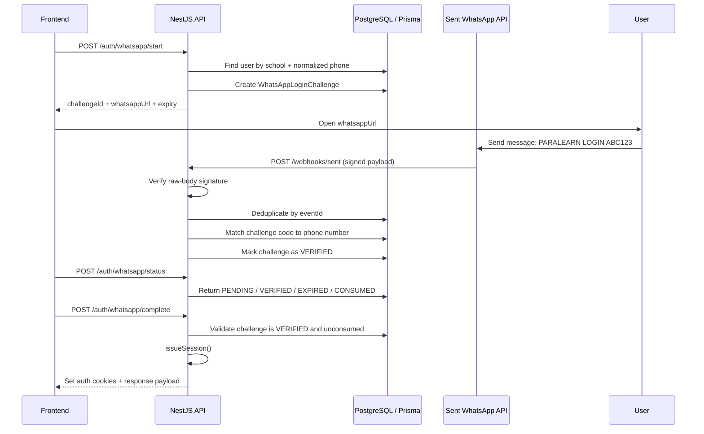

# ParaLearn WhatsApp Authentication + Sent Webhook Implementation

This document explains the current WhatsApp authentication and webhook implementation in the ParaLearn backend so another engineering team (for example, Antigravity) can implement the same pattern safely and consistently.

## 1. Overview

The current backend supports a tenant-scoped WhatsApp login flow for users who already have a valid school account and phone number on record.

The flow is:

1. A frontend or mobile client calls `/auth/whatsapp/start` with a phone number and the tenant subdomain.
2. The backend validates that the phone number belongs to the active school and user.
3. A challenge is generated and stored in the database.
4. The backend returns a WhatsApp deep-link URL that opens the user's chat with the configured Sent business number.
5. The user sends the challenge code in that chat.
6. Sent sends a webhook event to `/webhooks/sent`.
7. The backend verifies the webhook signature against the raw request body.
8. If the challenge code matches the one generated for the user, the record is marked as `VERIFIED`.
9. The caller then calls `/auth/whatsapp/complete` to issue the auth cookies and session.

This protects login against spoofing, replay, and duplicate webhook processing.

---

## 2. Why this pattern is used

The app does not trust that a webhook with a matching message is enough by itself. Instead, it treats the WhatsApp interaction as a challenge-response flow.

That gives two major benefits:

- It ensures the user who is logging in owns the phone number tied to the school account.
- It prevents arbitrary users from sending a random message to the business number and getting logged into someone else’s account.

This is the correct model for a secure login experience over WhatsApp.

---

## 3. High-level architecture



---

## 4. Key files in the current implementation

### 4.1 `src/auth/auth.controller.ts`

This controller exposes the authentication endpoints for the frontend.

Relevant endpoints:

- `POST /auth/whatsapp/start`
- `POST /auth/whatsapp/status`
- `POST /auth/whatsapp/complete`

Important behaviors:

- It expects the tenant subdomain from the request context.
- It validates the DTO through NestJS validation pipes.
- It calls the auth service to perform the actual challenge work.

These routes are intentionally designed to be simple for the caller: start, poll, complete.

### 4.2 `src/auth/auth.service.ts`

This is the core of the implementation.

It contains:

- `startWhatsAppLogin(phoneNumber, schoolId)`
- `getWhatsAppLoginStatus(challengeId)`
- `completeWhatsAppLogin(challengeId, res)`
- `verifySentWebhook(rawBody, webhookId, timestamp, signature)`
- `handleSentWebhook(input)`
- `issueSession(user, res)`

This class is responsible for:

- normalizing phone numbers
- identifying the correct user by school and phone number
- creating challenge records
- generating the WhatsApp URL
- verifying Sent signatures
- processing inbound messages
- issuing the application session cookies

### 4.3 `src/auth/whatsapp-webhook.controller.ts`

This is the public endpoint that Sent calls.

Route:

- `POST /webhooks/sent`

Important logic:

- Reads the raw request body before body parsing.
- Validates the Sent HMAC signature using the raw body.
- Reads the `X-Webhook-Event-ID` header and rejects missing events.
- Calls the auth service to process only valid events.

This endpoint must be public and should not be behind the tenant middleware because it is used by the external service.

### 4.4 `src/main.ts`

This file is very important because it preserves the raw request body for webhook verification.

The critical behavior is:

- Express JSON parsing is configured with a custom `verify` function.
- The raw bytes are stored on `req.rawBody`.
- This makes it possible to verify the exact payload Sent signed.

Without this step, signature validation would fail even when the webhook is legitimate.

### 4.5 `prisma/schema.prisma`

The database schema includes the key models for this flow:

- `WhatsAppLoginChallenge`
- `SentWebhookEvent`
- `User` indexes on `schoolId` and `phoneNumber`

The challenge table stores:

- `userId`
- `schoolId`
- `phoneNumber`
- `challengeHash`
- `status`
- `expiresAt`
- `attempts`
- `verifiedAt`
- `consumedAt`

This allows the backend to track:

- challenge expiry
- retry attempts
- state transitions
- event deduplication

---

## 5. Start flow: `/auth/whatsapp/start`

### Endpoint

`POST /auth/whatsapp/start`

### Expected request body

```json
{
  "phoneNumber": "+2348012345678"
}
```

### Behavior

1. Normalize the phone number via `normalizeWhatsAppNumber()`.
2. Resolve the active tenant from the request context (`X-Tenant-Subdomain`).
3. Find the user in the current school by:
   - `schoolId`
   - `phoneNumber`
   - `isActive = true`
4. If there is no such user, return 404.
5. Expire any existing pending challenges for the same user.
6. Generate a new challenge code, e.g. `ABC123XYZ...` in a secure random format.
7. Hash the code with bcrypt.
8. Save the challenge record with a 5-minute expiry.
9. Return a deep-link URL such as:

```text
https://wa.me/<business-number>?text=PARALEARN%20LOGIN%20ABC123
```

### Return payload example

```json
{
  "success": true,
  "message": "Open WhatsApp and send the prepared message to continue.",
  "data": {
    "challengeId": "cuid_here",
    "whatsappUrl": "https://wa.me/2348000000000?text=PARALEARN%20LOGIN%20A1B2C3D4E5F6G7H8",
    "expiresAt": "2026-09-20T10:12:00.000Z"
  }
}
```

### Important note

The phone number must already exist on the user record for the selected tenant. The logic does not create a new login from an arbitrary number.

---

## 6. Status flow: `/auth/whatsapp/status`

### Endpoint

`POST /auth/whatsapp/status`

### Request body

```json
{
  "challengeId": "challenge-cuid"
}
```

### Behavior

The API fetches the challenge from the database and responds with the state:

- `PENDING`
- `VERIFIED`
- `CONSUMED`
- `EXPIRED`

If the challenge expires, the status is converted to `EXPIRED` for the frontend.

This endpoint is intended for polling while the user is waiting in WhatsApp.

---

## 7. Complete flow: `/auth/whatsapp/complete`

### Endpoint

`POST /auth/whatsapp/complete`

### Behavior

The frontend should call this only after the status endpoint confirms `VERIFIED`.

The service then:

1. Loads the challenge and associated user.
2. Validates that the challenge is still in the verified state.
3. Confirms it has not expired or been consumed.
4. Marks the challenge as `CONSUMED`.
5. Calls `issueSession(user, res)`.

The session creation code sets the access and refresh cookies and returns the user payload.

This is the point where the phone-based challenge becomes an authenticated user session in the app.

---

## 8. Sent webhook verification

### Endpoint

`POST /webhooks/sent`

This endpoint is public and is configured in Sent as the callback target.

The service validates the webhook using:

- raw request body
- `X-Webhook-ID`
- `X-Webhook-Timestamp`
- `X-Webhook-Signature`

### Signature format

The implementation reconstructs the Sent signed payload as:

```text
{webhookId}.{timestamp}.{rawBody}
```

Then it signs it with HMAC-SHA256 using the base64-decoded secret and compares it to the exact Sent signature.

### Security rules used

- The secret must be present.
- The timestamp must be valid and reasonably fresh.
- The request body must be the exact raw payload Sent signed.
- The signature comparison uses `timingSafeEqual` to avoid timing attacks.

If any validation fails, the webhook is rejected with `401 Unauthorized`.

---

## 9. Webhook event processing

The webhook receives events and filters only for valid WhatsApp inbound message events:

```json
{
  "event": "message.received",
  "payload": {
    "channel": "whatsapp",
    "text": "PARALEARN LOGIN ABC123",
    "inbound_number": "+2348012345678"
  }
}
```

The service then:

1. Verifies the event type is `message.received`.
2. Verifies the channel is `whatsapp`.
3. Extracts the message text.
4. Parses the challenge code with a regex matching the format `PARALEARN LOGIN <hexcode>`.
5. Normalizes the inbound WhatsApp number.
6. Queries pending challenges for that phone number and school conditions.
7. Attempts to verify the code using `bcrypt.compare()`.
8. Marks the first valid match as `VERIFIED`.

### Why this is safe

- Only valid challenge codes for the correct phone number can be accepted.
- Pending challenge records expire after 5 minutes.
- Repeated invalid attempts are tracked with `attempts`.
- Duplicate webhook events are dropped via `SentWebhookEvent` dedupe.

---

## 10. Idempotency and deduplication

The backend stores every webhook event ID in `SentWebhookEvent`:

```prisma
model SentWebhookEvent {
  id          String   @id @default(cuid())
  eventId     String   @unique
  eventType   String
  processedAt DateTime @default(now())
}
```

This prevents the same inbound event from being processed twice.

If the same `X-Webhook-Event-ID` is received again, Prisma throws a unique constraint conflict and the service safely exits without reprocessing.

This is a critical piece for production reliability.

---

## 11. Data model and lookup strategy

The key lookup fields are intentionally indexed:

```prisma
@@index([schoolId, phoneNumber])
@@index([userId, status, expiresAt])
@@index([schoolId, phoneNumber, status, expiresAt])
```

This supports:

- quick user lookup by school and phone number
- quick pending challenge lookup by phone number
- quick expiry filtering

These indexes are essential when the app is used at scale with multiple schools and active login attempts.

---

## 12. Security posture of the current implementation

### Strengths

- raw request body is used for signature validation
- webhook payload is rejected before any business logic runs
- challenge is stored as a bcrypt hash, not in plaintext
- challenge expiry is enforced
- challenge consumption is single-use
- phone number normalization is enforced before lookup
- duplicate webhook events are ignored
- auth is bound to tenant context

### Important production hardening still recommended

These are not failures in the current implementation, but they are good production follow-ups:

- add rate limiting for `/auth/whatsapp/start` and `/webhooks/sent`
- restrict which IPs or networks can access the webhook endpoint
- log failed attempts with correlation IDs
- enforce phone number validation and uniqueness per school
- add a `retryAfter` or backoff strategy for repeated challenge requests
- add monitoring for `SENT_WEBHOOK_SECRET` and `SENT_WHATSAPP_NUMBER` misconfiguration

---

## 13. Required environment variables

The app expects these values to be configured:

```env
DATABASE_URL=...
JWT_SECRET=...
SENT_WEBHOOK_SECRET=whsec_...
SENT_WHATSAPP_NUMBER=+2348000000000
SENT_WEBHOOK_ID=...
SENT_ACCOUNT_ID=...
```

### Meaning

- `SENT_WEBHOOK_SECRET`: secret used to verify Sent payload signatures.
- `SENT_WHATSAPP_NUMBER`: the business WhatsApp number that receives the challenge message.
- `SENT_WEBHOOK_ID`: ID configured in the Sent dashboard callback.
- `SENT_ACCOUNT_ID`: account identifier used in Sent account settings.

If these values are missing, the WhatsApp login flow cannot function correctly in production.

---

## 14. Implementation guidelines for Antigravity

If Antigravity is implementing the same design in another backend, the recommended architecture is:

### Required behavior

1. Create a public webhook route for the provider.
2. Preserve raw request bytes before JSON parsing.
3. Use the provider’s signed payload format to verify the request.
4. Reject invalid or expired signatures before business logic.
5. Store event IDs in a dedupe table.
6. Use a challenge table with expiry and status tracking.
7. Match challenge codes to the user’s phone number and school.
8. Use a secure hash algorithm for challenge storage.
9. Keep the frontend flow simple: start → poll → complete.
10. Issue the normal app session only after verification succeeds.

### Recommended implementation pattern

- Use a `Challenge` table with columns like:
  - `id`
  - `userId`
  - `schoolId`
  - `phoneNumber`
  - `challengeHash`
  - `status`
  - `expiresAt`
  - `attempts`
  - `verifiedAt`
  - `consumedAt`
- Use `bcrypt.hash` or a similar password-strength hash for the generated challenge code.
- Use a dedupe table for the webhook event ID.
- Normalize phone numbers to E.164 before storing and matching.
- Keep the challenge handler independent from the main authentication logic.

---

## 15. Practical integration notes for frontend teams

The frontend should only do the following:

1. Call `POST /auth/whatsapp/start` with the user phone number.
2. Use the returned `whatsappUrl` to open WhatsApp.
3. Poll `POST /auth/whatsapp/status` until the challenge is `VERIFIED`.
4. Call `POST /auth/whatsapp/complete` to finalize the login.

The frontend must not directly call the Sent webhook route. That route is server-to-server only.

---

## 16. Current status of the implementation

The current codebase already contains the following working pieces:

- WhatsApp challenge start endpoint
- challenge status polling endpoint
- complete login endpoint
- public Sent webhook endpoint
- signature validation using raw request bytes
- dedupe handling for webhook event IDs
- Prisma challenge and event models
- session issuance after successful verification

This gives a production-ready foundation for secure WhatsApp login using Sent webhooks.

---

## 17. Summary

The existing ParaLearn implementation is a challenge-based WhatsApp authentication flow that is intentionally designed to be secure, tenant-aware, and reliable under webhook retries. It converts the WhatsApp message into a cryptographic challenge-response, validates it against the actual signed webhook payload, and only then creates a valid application session.

This is the correct pattern for Antigravity to implement if the goal is a secure WhatsApp login system connected to a provider like Sent.
