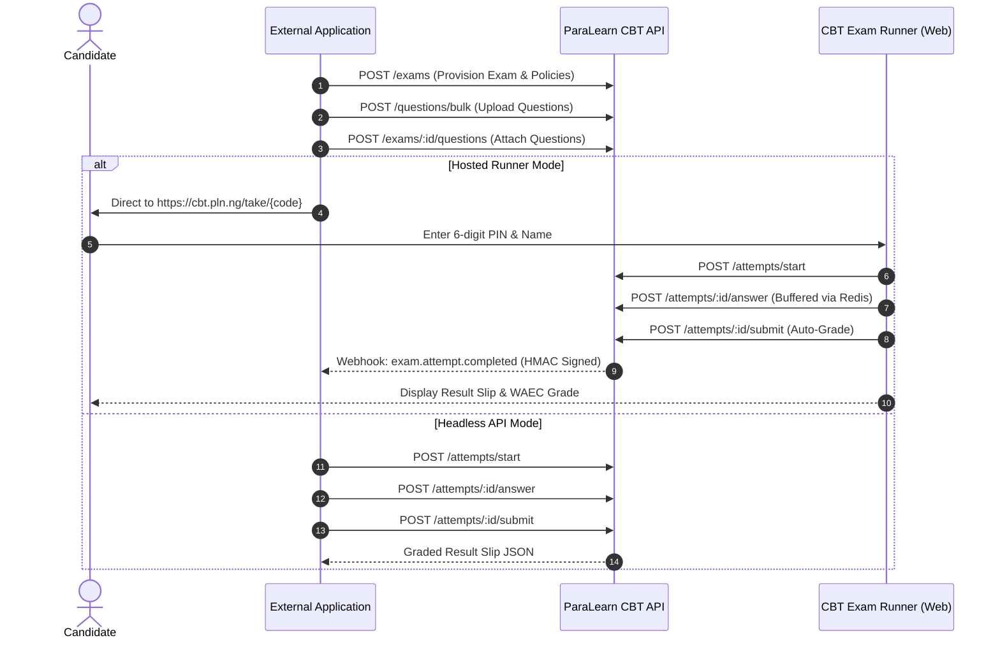

# ParaLearn CBT — External Developer API Documentation
Version: `1.0.0` | Base URL: `https://cbt-api.pln.ng` (Sandbox: `http://localhost:4000`)

Welcome to the **ParaLearn Computer-Based Testing (CBT) API**. This documentation allows external applications—such as third-party Learning Management Systems (LMS), school portals, tutorial centre web/mobile apps, and recruitment assessment engines—to programmatically provision exams, manage question banks, deliver high-concurrency candidate tests, monitor proctoring telemetry in real time, and receive auto-graded results via webhooks.

---

## Table of Contents
1. [Architecture & Integration Modes](#1-architecture--integration-modes)
2. [Authentication & Workspace Headers](#2-authentication--workspace-headers)
3. [Quickstart Workflow (End-to-End)](#3-quickstart-workflow-end-to-end)
4. [API Endpoints Reference](#4-api-endpoints-reference)
   - [Workspaces & Developer Keys](#a-workspaces--developer-keys)
   - [Exams Management](#b-exams-management)
   - [Questions & Bulk Ingestion](#c-questions--bulk-ingestion)
   - [Candidate Session & Live Runner](#d-candidate-session--live-runner)
   - [Proctoring & Anti-Cheat Telemetry](#e-proctoring--anti-cheat-telemetry)
   - [Submission & Result Slips](#f-submission--result-slips)
   - [Data Export & Sync](#g-data-export--sync)
5. [Webhooks & Signature Verification](#5-webhooks--signature-verification)
6. [Code Examples](#6-code-examples)
   - [Node.js / TypeScript](#nodejs--typescript)
   - [Python](#python)
   - [cURL](#curl)
7. [Error Codes & HTTP Standards](#7-error-codes--http-standards)

---

## 1. Architecture & Integration Modes

You can integrate ParaLearn CBT using two primary modes:

### Mode A: Hosted Candidate Portal (Recommended)
You manage exams and questions via API. When candidates are ready to test, you redirect them to the ParaLearn CBT runner:
```
https://cbt.pln.ng/take/{ACCESS_CODE}
```
The candidate enters their unique 6-digit PIN. ParaLearn handles the sub-millisecond countdown timer, offline resilience, and anti-cheat tracking. Upon completion, ParaLearn dispatches the scores back to your webhook URL.

### Mode B: Headless API Integration (Custom UI)
Your application builds its own exam UI and calls our low-latency endpoints directly:
- `POST /attempts/start` to initiate session.
- `POST /attempts/:id/answer` to buffer candidate choices into Redis (<5ms latency).
- `POST /attempts/:id/telemetry` to record window blur / tab switches.
- `POST /attempts/:id/submit` for atomic auto-grading.



---

## 2. Authentication & Workspace Headers

Every request from an external application must authenticate using an API key issued to your workspace.

### Headers
| Header | Value | Description |
| :--- | :--- | :--- |
| `Authorization` | `Bearer pln_live_sk_...` | Your secret API key |
| `x-api-key` | `pln_live_sk_...` | Alternative header for API key |
| `Content-Type` | `application/json` | Required for POST/PATCH bodies |

> [!CAUTION]
> Keep your secret API key (`pln_live_sk_...`) confidential. Never expose it in client-side code, mobile application bundles, or public repositories.

---

## 3. Quickstart Workflow (End-to-End)

To create and run an exam programmatically:

1. **Create Workspace & Get API Key:** Call `POST /workspaces/standalone`. You receive an API key and **30 free candidate credits**.
2. **Create Exam:** Call `POST /exams` with title, duration, and room access code.
3. **Upload Questions:** Call `POST /questions/bulk` or `POST /questions/import-excel`.
4. **Attach Questions:** Call `POST /exams/:id/questions`.
5. **Publish Exam:** Call `PATCH /exams/:id` setting `isPublished: true`.
6. **Provide Candidate Link:** Share `https://cbt.pln.ng/take/{ACCESS_CODE}` with candidate.
7. **Receive Results:** Receive automatic HMAC-signed webhook dispatches at your configured `webhookUrl`.

---

## 4. API Endpoints Reference

### A. Workspaces & Developer Keys

#### 1. Register Workspace (Get API Key)
`POST /workspaces/standalone`

Creates an autonomous exam hall workspace, allocates 30 free test credits, and returns your developer credentials.

**Request Body:**
```json
{
  "name": "Standard Assessment Centre",
  "ownerName": "Centre Administrator",
  "email": "examiner@example.com",
  "webhookUrl": "https://api.example.com/webhooks/cbt-results"
}
```

**Response (201 Created):**
```json
{
  "id": "ws_sample_0001",
  "name": "Standard Assessment Centre",
  "type": "STANDALONE_HALL",
  "ownerName": "Centre Administrator",
  "ownerEmail": "examiner@example.com",
  "credits": 30,
  "apiKey": "pln_live_sk_sample_••••••••••••••••",
  "webhookUrl": "https://api.example.com/webhooks/cbt-results",
  "webhookSecret": "pln_whsec_sample_••••••••••••••••",
  "createdAt": "2026-09-29T16:00:00.000Z"
}
```

#### 2. Examiner Sign-In & Workspace Recovery
`POST /workspaces/login`

Sign in as an existing examiner using registered email. Retrieves the workspace profile, API keys, remaining candidate credits, and aggregate counts (`exams`, `questions`). If the email is not yet registered, it automatically provisions an Exam Hall with 30 free credits so the examiner is never stranded.

**Request Body:**
```json
{
  "email": "examiner@example.com",
  "password": "your_secure_password"
}
```

**Response (200 OK):**
```json
{
  "id": "ws_sample_0001",
  "name": "Standard Assessment Centre",
  "ownerName": "Centre Administrator",
  "ownerEmail": "examiner@example.com",
  "credits": 30,
  "apiKey": "pln_live_sk_sample_••••••••••••••••",
  "webhookSecret": "pln_whsec_sample_••••••••••••••••",
  "_count": {
    "exams": 4,
    "questions": 150
  }
}
```

#### 3. School SIS SSO Workspace Provisioning
`POST /workspaces/institution`

Provisions or synchronizes a multi-tenant exam hall linked to an accredited school in the ParaLearn School Information System (SIS). Automatically syncs school branding, principal access, and term sessions.

**Request Body:**
```json
{
  "schoolId": "sch_sample_99182",
  "schoolName": "Exemplar Academy",
  "email": "admin@school.example.edu.ng"
}
```

**Response (200 OK / 201 Created):**
```json
{
  "id": "ws_inst_99182",
  "name": "Exemplar Academy",
  "type": "INSTITUTION",
  "schoolId": "sch_sample_99182",
  "credits": 999999,
  "apiKey": "pln_live_sk_sample_••••••••••••••••"
}
```

#### 4. Get Workspace Profile & Credits
`GET /workspaces/:id`

**Response (200 OK):**
```json
{
  "id": "ws_sample_0001",
  "name": "Standard Assessment Centre",
  "credits": 28,
  "_count": {
    "exams": 4,
    "questions": 150
  }
}
```

#### 5. Rotate API Key
`POST /workspaces/:id/rotate-api-key`

Immediately invalidates old key and issues a fresh one.

---

### B. Exams Management

#### 1. Create Exam
`POST /exams`

**Headers:**
`Authorization: Bearer <API_KEY>`

**Request Body:**
```json
{
  "workspaceId": "cly7q1m8x0001",
  "title": "JAMB UTME 2026 Mock — Physics & Chemistry",
  "instructions": "Calculators are permitted on-screen. 40 questions to be answered in 60 minutes.",
  "durationMins": 60,
  "accessType": "ACCESS_CODE",
  "accessCode": "JAMB-2026-PC1",
  "maxTabViolations": 3,
  "shuffleQuestions": true,
  "shuffleChoices": true,
  "showResultAfter": true
}
```

**Response (201 Created):**
```json
{
  "id": "exam_clx9921",
  "workspaceId": "cly7q1m8x0001",
  "title": "JAMB UTME 2026 Mock — Physics & Chemistry",
  "accessCode": "JAMB-2026-PC1",
  "durationMins": 60,
  "maxTabViolations": 3,
  "shuffleQuestions": true,
  "shuffleChoices": true,
  "showResultAfter": true,
  "isPublished": false,
  "totalMarks": 0,
  "createdAt": "2026-09-29T16:10:00.000Z"
}
```

#### 2. Publish / Update Exam
`PATCH /exams/:id`

**Request Body:**
```json
{
  "isPublished": true,
  "durationMins": 45
}
```

#### 3. Public Candidate Lobby Lookup
`GET /exams/code/:accessCode`

Used by candidate entry gates to check validity and view metadata. **Correct answers are stripped.**

**Response (200 OK):**
```json
{
  "id": "exam_clx9921",
  "accessCode": "JAMB-2026-PC1",
  "title": "JAMB UTME 2026 Mock — Physics & Chemistry",
  "instructions": "Calculators are permitted on-screen.",
  "durationMins": 60,
  "totalQuestions": 40,
  "totalMarks": 40.0,
  "maxTabViolations": 3,
  "workspaceName": "Apex Educational Centre"
}
```

#### 4. Live Proctoring Monitor
`GET /exams/:id/monitor`

Returns real-time invigilation telemetry.

**Response (200 OK):**
```json
{
  "exam": {
    "id": "exam_clx9921",
    "title": "JAMB UTME 2026 Mock",
    "accessCode": "JAMB-2026-PC1"
  },
  "metrics": {
    "totalEnrolled": 85,
    "inProgress": 32,
    "submitted": 51,
    "disqualified": 2,
    "averageScore": 68
  },
  "candidates": [
    {
      "id": "att_001",
      "candidateName": "Chukwudi Eze",
      "candidatePin": "481920",
      "status": "IN_PROGRESS",
      "violations": 1,
      "startedAt": "2026-09-29T16:30:00.000Z"
    }
  ]
}
```

---

### C. Questions & Bulk Ingestion

#### 1. Bulk Ingest Questions
`POST /questions/bulk`

Supports Markdown and KaTeX LaTeX formulas (`$\Delta v = a \cdot t$`).

**Request Body:**
```json
{
  "workspaceId": "cly7q1m8x0001",
  "examId": "exam_clx9921",
  "questions": [
    {
      "workspaceId": "cly7q1m8x0001",
      "prompt": "Calculate the kinetic energy of a $2\\text{ kg}$ object moving at $3\\text{ m/s}$.",
      "type": "MCQ",
      "marks": 1.0,
      "options": [
        { "id": "opt_a", "keyLabel": "A", "text": "6 Joules", "isCorrect": false },
        { "id": "opt_b", "keyLabel": "B", "text": "9 Joules", "isCorrect": true },
        { "id": "opt_c", "keyLabel": "C", "text": "12 Joules", "isCorrect": false },
        { "id": "opt_d", "keyLabel": "D", "text": "18 Joules", "isCorrect": false }
      ],
      "explanation": "$E_k = \\frac{1}{2}mv^2 = 0.5 \\times 2 \\times 3^2 = 9\\text{ J}$."
    }
  ]
}
```

#### 2. Import Excel Spreadsheet
`POST /questions/import-excel` (Content-Type: `multipart/form-data`)

Uploads `.xlsx` file with headers: `Question`, `Option A`, `Option B`, `Option C`, `Option D`, `Correct Answer`, `Marks`, `Explanation`.

**Form Fields:**
- `file`: binary `.xlsx`
- `workspaceId`: `"cly7q1m8x0001"`
- `examId`: `"exam_clx9921"` (optional, attaches directly to exam)

---

### D. Candidate Session & Live Runner

#### 1. Start Exam Attempt
`POST /attempts/start`

Initiates the candidate's test session, validates candidate PIN, sets sub-millisecond Redis timer, and returns questions **with all answer keys removed**.

**Request Body:**
```json
{
  "accessCode": "JAMB-2026-PC1",
  "candidatePin": "849201",
  "candidateName": "Oluwaseun Adeleke",
  "studentId": "ext_student_908",
  "ipAddress": "198.51.100.42",
  "userAgent": "Mozilla/5.0 Chrome/130.0"
}
```

**Response (200 OK):**
```json
{
  "isResumed": false,
  "attemptId": "att_cly99182",
  "examId": "exam_clx9921",
  "examTitle": "JAMB UTME 2026 Mock — Physics & Chemistry",
  "candidateName": "Oluwaseun Adeleke",
  "candidatePin": "849201",
  "durationMins": 60,
  "deadline": "2026-09-29T17:45:00.000Z",
  "remainingSeconds": 3600,
  "violations": 0,
  "maxTabViolations": 3,
  "questions": [
    {
      "id": "q_01",
      "prompt": "Calculate the kinetic energy of a $2\\text{ kg}$ object moving at $3\\text{ m/s}$.",
      "type": "MCQ",
      "marks": 1.0,
      "options": [
        { "id": "opt_a", "keyLabel": "A", "text": "6 Joules" },
        { "id": "opt_b", "keyLabel": "B", "text": "9 Joules" },
        { "id": "opt_c", "keyLabel": "C", "text": "12 Joules" },
        { "id": "opt_d", "keyLabel": "D", "text": "18 Joules" }
      ]
    }
  ],
  "restoredAnswers": {}
}
```

#### 2. Buffer Ephemeral Answer (High Throughput)
`POST /attempts/:id/answer`

Buffers candidate choices directly into an in-memory Redis hash. Response time is `<5ms`, with zero Postgres disk I/O during the live test.

**Request Body:**
```json
{
  "questionId": "q_01",
  "selectedVal": { "selected": "opt_b" }
}
```

**Response (200 OK):**
```json
{
  "success": true,
  "savedAt": "2026-09-29T16:48:12.190Z"
}
```

---

### E. Proctoring & Anti-Cheat Telemetry

#### 1. Report Malpractice Telemetry Event
`POST /attempts/:id/telemetry`

Called by the browser when a candidate switches tabs, blurs the browser window, or exits fullscreen mode. If `violations >= maxTabViolations`, candidate is automatically disqualified.

**Request Body:**
```json
{
  "eventType": "tab_switch",
  "timestamp": "2026-09-29T16:50:00.000Z",
  "questionIdx": 14
}
```

**Response (Normal Warning):**
```json
{
  "disqualified": false,
  "violations": 1,
  "remainingViolations": 2
}
```

**Response (Auto-Disqualified):**
```json
{
  "disqualified": true,
  "violations": 3,
  "message": "Maximum tab switch limit reached. You have been disqualified from this session."
}
```

---

### F. Submission & Result Slips

#### 1. Submit Exam & Auto-Grade
`POST /attempts/:id/submit`

Performs atomic submission, merges Redis buffer, executes deterministic grading, computes percentage and assigns Nigerian standard WAEC grade (`A1`–`F9`), and triggers the webhook dispatch.

**Request Body:**
```json
{
  "autoSubmitted": false,
  "finalAnswers": {
    "q_01": { "selected": "opt_b" }
  }
}
```

**Response (200 OK):**
```json
{
  "attemptId": "att_cly99182",
  "candidateName": "Oluwaseun Adeleke",
  "candidatePin": "849201",
  "studentId": "ext_student_908",
  "examTitle": "JAMB UTME 2026 Mock — Physics & Chemistry",
  "accessCode": "JAMB-2026-PC1",
  "institutionName": "Apex Educational Centre",
  "startedAt": "2026-09-29T16:45:00.000Z",
  "submittedAt": "2026-09-29T17:25:00.000Z",
  "timeSpentMins": 40,
  "score": 38.0,
  "totalMarks": 40.0,
  "percentage": 95.0,
  "grade": "A1",
  "violations": 1,
  "status": "SUBMITTED",
  "showResultAfter": true,
  "breakdown": {
    "totalQuestions": 40,
    "correctCount": 38,
    "wrongCount": 2,
    "unattemptedCount": 0
  }
}
```

#### 2. Get Result Slip
`GET /attempts/:id/slip`

Retrieves the candidate's formal result slip.

---

### G. Data Export & Sync

#### 1. Download Exam CSV Score Sheet
`GET /sync/export-csv/:examId`

Returns a downloadable `text/csv` stream containing candidate names, PINs, external student IDs, raw scores, percentages, WAEC grades, violations, and submission timestamps.

#### 2. Sync to ParaLearn Core Report Cards
`POST /sync/export-scores/:examId`

Dispatches all submitted scores to the school's continuous assessment term report cards.

---

## 5. Webhooks & Signature Verification

When a candidate finishes an exam, ParaLearn CBT sends an HTTP `POST` request to your registered `webhookUrl`.

### Webhook Headers
| Header | Description |
| :--- | :--- |
| `x-cbt-event` | Event type: `exam.attempt.completed` |
| `x-cbt-signature` | `sha256=<hex_digest>` generated using your `webhookSecret` |
| `Content-Type` | `application/json` |

### Webhook Payload Example
```json
{
  "event": "exam.attempt.completed",
  "timestamp": "2026-09-29T17:25:01.000Z",
  "attemptId": "att_cly99182",
  "examId": "exam_clx9921",
  "studentId": "ext_student_908",
  "candidateName": "Oluwaseun Adeleke",
  "candidatePin": "849201",
  "score": 38.0,
  "totalMarks": 40.0,
  "percentage": 95.0,
  "grade": "A1",
  "resultSlip": {
    "timeSpentMins": 40,
    "violations": 1,
    "breakdown": {
      "totalQuestions": 40,
      "correctCount": 38,
      "wrongCount": 2
    }
  }
}
```

### Signature Verification Code

#### Node.js / Express
```javascript
const crypto = require("crypto");

function verifyCbtWebhook(rawBody, signatureHeader, secret) {
  const hash = crypto.createHmac("sha256", secret).update(rawBody).digest("hex");
  const expected = `sha256=${hash}`;
  return crypto.timingSafeEqual(Buffer.from(signatureHeader), Buffer.from(expected));
}

// In your Express route handler:
app.post("/webhooks/cbt-results", express.raw({ type: "application/json" }), (req, res) => {
  const sig = req.headers["x-cbt-signature"];
  const secret = process.env.CBT_WEBHOOK_SECRET;

  if (!verifyCbtWebhook(req.body, sig, secret)) {
    return res.status(401).send("Invalid signature");
  }

  const event = JSON.parse(req.body);
  console.log(`Student ${event.candidateName} scored ${event.percentage}% (Grade: ${event.grade})`);
  
  res.status(200).json({ received: true });
});
```

#### Python / FastAPI
```python
import hmac
import hashlib
from fastapi import FastAPI, Request, HTTPException

app = FastAPI()
WEBHOOK_SECRET = "pln_whsec_1234567890abcdef"

@app.post("/webhooks/cbt-results")
async def receive_cbt_result(request: Request):
    signature = request.headers.get("x-cbt-signature", "")
    body = await request.body()
    
    expected_sig = "sha256=" + hmac.new(WEBHOOK_SECRET.encode(), body, hashlib.sha256).hexdigest()
    if not hmac.compare_digest(signature, expected_sig):
        raise HTTPException(status_code=401, detail="Invalid HMAC signature")
        
    data = await request.json()
    print(f"Received result for {data['candidateName']}: {data['grade']}")
    return {"status": "ok"}
```

---

## 6. Code Examples

### Node.js / TypeScript
```typescript
import axios from "axios";

const CBT_API = "https://cbt-api.pln.ng";
const API_KEY = "pln_live_sk_your_key_here";

const client = axios.create({
  baseURL: CBT_API,
  headers: {
    Authorization: `Bearer ${API_KEY}`,
    "Content-Type": "application/json",
  },
});

async function createAndPublishExam() {
  // 1. Create Exam
  const { data: exam } = await client.post("/exams", {
    workspaceId: "cly7q1m8x0001",
    title: "WAEC 2026 Biology Prep Test",
    durationMins: 45,
    accessCode: "BIO-2026-T1",
    maxTabViolations: 3,
  });

  console.log(`Exam created with room code: ${exam.accessCode}`);

  // 2. Attach Questions
  await client.post("/questions/bulk", {
    workspaceId: "cly7q1m8x0001",
    examId: exam.id,
    questions: [
      {
        workspaceId: "cly7q1m8x0001",
        prompt: "Which organelle is the powerhouse of the cell?",
        type: "MCQ",
        marks: 1.0,
        options: [
          { id: "a", keyLabel: "A", text: "Nucleus", isCorrect: false },
          { id: "b", keyLabel: "B", text: "Mitochondria", isCorrect: true },
          { id: "c", keyLabel: "C", text: "Ribosome", isCorrect: false },
        ],
      },
    ],
  });

  // 3. Publish
  await client.patch(`/exams/${exam.id}`, { isPublished: true });

  console.log(`Exam published! Direct candidates to: https://cbt.pln.ng/take/${exam.accessCode}`);
}

createAndPublishExam();
```

### Python
```python
import requests

CBT_API = "https://cbt-api.pln.ng"
API_KEY = "pln_live_sk_your_key_here"

headers = {
    "Authorization": f"Bearer {API_KEY}",
    "Content-Type": "application/json"
}

# Fetch Live Monitor Metrics
response = requests.get(f"{CBT_API}/exams/exam_clx9921/monitor", headers=headers)
stats = response.json()

print(f"Total Enrolled: {stats['metrics']['totalEnrolled']}")
print(f"Average Score: {stats['metrics']['averageScore']}%")
```

### cURL
```bash
# 1. Start an attempt
curl -X POST "https://cbt-api.pln.ng/attempts/start" \
  -H "Content-Type: application/json" \
  -d '{
    "accessCode": "BIO-2026-T1",
    "candidatePin": "902184",
    "candidateName": "Fatima Bello"
  }'

# 2. Buffer an answer
curl -X POST "https://cbt-api.pln.ng/attempts/att_cly99182/answer" \
  -H "Content-Type: application/json" \
  -d '{
    "questionId": "q_01",
    "selectedVal": { "selected": "b" }
  }'

# 3. Submit exam
curl -X POST "https://cbt-api.pln.ng/attempts/att_cly99182/submit" \
  -H "Content-Type: application/json" \
  -d '{"autoSubmitted": false}'
```

---

## 7. Error Codes & HTTP Standards

ParaLearn CBT returns standard HTTP response codes accompanied by structured JSON error payloads:

```json
{
  "statusCode": 403,
  "message": "Insufficient candidate credits. Please top up your exam hall balance.",
  "error": "Forbidden"
}
```

| HTTP Status | Error Scenario | Resolution |
| :--- | :--- | :--- |
| `400 Bad Request` | Missing required fields, invalid Excel format, or exam unpublished | Inspect payload requirements or publish exam |
| `401 Unauthorized` | Missing or invalid API key / webhook signature mismatch | Check `Authorization: Bearer <API_KEY>` |
| `403 Forbidden` | Candidate credits depleted or candidate disqualified due to violations | Top up workspace credit balance |
| `404 Not Found` | Exam ID, access code, or attempt ID not found | Verify room code or ID spelling |
| `409 Conflict` | Access code already in use or candidate PIN already submitted | Use a unique access code or candidate PIN |
| `500 Server Error` | Unexpected internal exception | Automatic retry with exponential backoff |

---

## Need Support or Custom Integration?
- **Interactive Swagger Documentation:** [`http://localhost:4000/api/docs`](http://localhost:4000/api/docs)
- **Developer Portal:** `https://cbt.pln.ng/developers`
- **Technical Support:** `dev@pln.ng`
